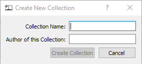

Adding a New Collection
=======================

An administrator can add Collections to the system by means of the dialog box above.  A Collection consists of its
name, its author (if given) and a list of puzzles.  Collections are contained in files ending with a ".col" extension
and saved in the main program's "Collections" directory.  The dialog box above is used to create the bare bones of a
collection, that is, its name and author, and create the file on disk.  Puzzles need to be added later.  See
:doc:`addeditpuzzles`.  The following chart outlines the use of the **Add Collection** dialog box.

+------------------------+---------------------------------------------------------------------+
| **Collection Name:**   | Enter a name for this collection.  The name you choose will be used |
|                        | to create a file name for the collection which will be saved in the |
|                        | Collections directory in the game's main directory.  The file name  |
|                        | created by the program can be changed later, if you so desire, by   |
|                        | the normal means provided by your computer's operating system.  The |
|                        | Collection Name entered here will not be affected.                  |
+------------------------+---------------------------------------------------------------------+
| **Author (optional):** | This could be the author of the book from which the puzzles come,   |
|                        | the name of the magazine, or it can be left blank.                  |
+------------------------+---------------------------------------------------------------------+
| **Create Collection**  | This button is activated once the Collection name is entered.  Click|
|                        | it to save the collection.  Once the collection is saved, you may   |
|                        | add puzzles by clicking the **Add Puzzles** button (see below).     |
+------------------------+---------------------------------------------------------------------+
| **Cancel**             | Click this button to close this dialog box without saving anything  |
|                        | to the local disk.  No changes you made will be saved.              |
+------------------------+---------------------------------------------------------------------+

A new collection is pretty worthless without puzzles.  After creating a new collection you still need to add puzzles.
See :doc:`addeditpuzzles` for more information.

