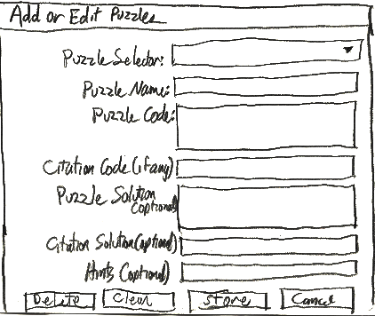

Adding and Editing Puzzles in a Collection
==========================================

Administrators of Cryptogram Solver can add puzzles, edit or delete existing puzzles in a collection.  The Add/Edit
Collection dialog box appears when you have clicked the **Add New Puzzle** button, (See: :doc:`addcollection`.) when
you have selected **Edit Puzzles** from the Admin menu, or when you have clicked the [] icon on the task bar.  When
editing the puzzles of an existing collection this dialog box will be set to edit the current puzzle when you first
enter it but that may be changed by use of the **Puzzle Selector**.

The following chart outlines the use of the dialog box:

+------------------------+---------------------------------------------------------------------+
| **Add New Puzzle**     | Click this button to add a new puzzle to the current collection.    |
|                        | Clicking this button will activate the **Puzzle Editor** panel, if  |
|                        | necessary, or clear whatever may be displayed there to start you    |
|                        | with a clean slate for creating a new puzzle. Once clicked it will  |
|                        | be disabled until the new puzzle is saved, or the Cancel Puzzle     |
|                        | button is clicked.                                                  |
+------------------------+---------------------------------------------------------------------+
| **Puzzle Selector**    | This combo box contains the names of existing puzzles, if any, and  |
|                        | can be used to select a puzzle to work on.  When adding a new       |
|                        | puzzle this is blank until the **Save Puzzle** button is pressed.   |
+------------------------+---------------------------------------------------------------------+
| **Puzzle Name**        | Type the desired name of the puzzle into this box or keep the       |
|                        | default which is Puzzle n, where n is the next number at the end of |
|                        | the sequence of puzzles.  If you use that format (Puzzle n) for an  |
|                        | existing puzzle, that puzzle, and all of the puzzles after it, will |
|                        | be shifted up in the list and their numbers adjusted accordingly.   |
|                        | This gives you the ability to, for instance, insert a puzzle you    |
|                        | have forgotten.  If there are gaps in the sequence you can fill     |
|                        | them the same way.  If you do not use the Puzzle n format and you   |
|                        | type the name of an existing puzzle you will be asked if you want   |
|                        | to replace the existing puzzle when you press the **Save Puzzle**   |
|                        | button.  Every puzzle must have a name so if this  box is blank,    |
|                        | none of the rest of the controls will be activated.                 |
+------------------------+---------------------------------------------------------------------+
| **Puzzle Code**        | Type the cryptogram itself into this box.  The characters you type  |
|                        | will automatically be converted to upper case.  Every puzzle must   |
|                        | have a code so if this box is blank, none of the rest of the        |
|                        | controls will be activated.  There must be an entry in this box     |
|                        | before the **Store** button will be activated.                      |
+------------------------+---------------------------------------------------------------------+
| **Citation Code**      | If the puzzle is a quote from a particular source, and the          |
| **(if any)**           | citation is part of the puzzle, type its code here.  It needs to    |
|                        | to follow the same key as the puzzle code.  In other words, if A=K  |
|                        | in the main puzzle, A=K in the citation code too.                   |
+------------------------+---------------------------------------------------------------------+
| **Puzzle Solution**    | Type the solution to the puzzle in this box.  The characters you    |
| **(optional)**         | type will automatically be converted to upper case.  If you want to |
|                        | use Cryptogram Solver to find the solution yourself, you may leave  |
|                        | this blank for now and save the solution after solving it by        |
|                        | clicking "Save Solution" on the Admin menu.                         |
+------------------------+---------------------------------------------------------------------+
| **Citation Solution**  | Type the citation, if any, as to the source of this puzzle in this  |
| **(optional)**         | box.  As with the puzzle solution, you may leave this blank and     |
|                        | save it later by using Cryptogram Solver to solve the puzzle        |
|                        | yourself and then clicking **Save Solution** on the Admin menu.     |
+------------------------+---------------------------------------------------------------------+
| **Hints (optional)**   | Some cryptogram books come with hints as to the solutions of the    |
|                        | puzzles.  These hints, if any, can be entered here separated by     |
|                        | semicolons.  For example, if you enter **A=K; B=Q** into the box,   |
|                        | the first hint given when the user clicks "Get Hint" on the puzzle  |
|                        | menu is that A=K.  That is, all appearances of the letter A in the  |
|                        | puzzle code will have the solution slots above them replaced with   |
|                        | the letter K.  If the user clicks "Get Hint" again, the letter Q    |
|                        | will be filled in above all occurences of the letter B.  This will  |
|                        | continue for as long as there are hints remaining.                  |
+------------------------+---------------------------------------------------------------------+
| **Delete**             | If you want to delete the puzzle currently listed in the Puzzle     |
|                        | Selector box, click this button.  You will be asked to confirm the  |
|                        | deletion.  If you do, the puzzle will be deleted from the           |
|                        | collection which cannot be undone.  If this puzzle was selected in  |
|                        | the main program, the main program's current puzzle will be changed |
|                        | to the next one, if possible, or the previous one if this was the   |
|                        | last.                                                               |
+------------------------+---------------------------------------------------------------------+
| **Clear**              | Press this button to clear all of the Add or Edit Puzzle controls.  |
|                        | This provides a quick means of erasing extensive mistakes.          |
+------------------------+---------------------------------------------------------------------+
| **Save**               | Once you have entered at least the Puzzle Name and Puzzle Code,     |
|                        | this button will be activated and you can click it to save the      |
|                        | puzzle.  If this is a new puzzle you are adding to the collection,  |
|                        | it's name will be added to the **Puzzle Selector**.                 |
+------------------------+---------------------------------------------------------------------+
| **Cancel**             | Closes the Add or Edit Puzzles dialog box without making any        |
|                        | further changes.  Every puzzle that was previously saved during the |
|                        | session will, however, still be saved.                              |
+------------------------+---------------------------------------------------------------------+
