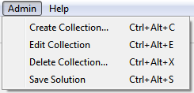

.. |addcollectionicon| image:: ../src/images/addCollectionSmall.png

The Admin Menu
==============

The Admin menu, which is only available when an administrator is logged in, provides the functions needed to manage
all the puzzles available to any other users of the program such as creating or deleting puzzle collections, adding or
editing individual puzzles within a collection or providing a solution or hints to a particular puzzle.  These functions
are designed so that administrators can enjoy the puzzles too.

Create Collection...
--------------------
To create a new collection select "Create Collection..." from the menu bar, using the keyboard shortcut Ctrl-Alt-C,
or by clicking the |addcollectionicon| icon on the toolbar.  See :doc:`addcollection` for more information.

:doc:`addeditpuzzles`

Edit Collection...
------------------

Delete Collection...
--------------------

Save Solution
-------------

