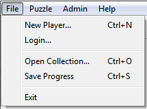

The File Menu
=============

The file menu makes available some of the fundamental elements of using the **Cryptogram Solver** program:  registering and
identifying the current player, selecting the set of puzzles to be solved and exiting the program.

.. _new-player-label:

New Player...
-------------

To add a new player to the system click "New Player" on the File menu.  A dialog box will appear asking for your name
and the password you want to use. (The password is saved in a form that makes it difficult for casual users to find out
what it is, but could easily be discovered by someone more expert at doing such things. Don't use your bank password!)
Once registered you will be able to enter into the program, load a collection of puzzles and start solving them.
Cryptogram Solver keeps track of what collection and which puzzle you are currently working on as well as keeping track
of which puzzles you have already solved successfully -- that is, by getting a "pass" upon checking the solution.

**Cryptogram Solver** presumes that the first player to be added is the administrator of the program for this computer.
An administrator has the ability to add or edit collections and puzzles as well as designating other players as
administrators. If a player forgets his or her password an administrator can assign a temporary password which will
allow the user to log in and, if desired, change the password assigned by the administrator. Administrators cannot,
however, see the passwords of other players. When an administrator logs in there is an extra
:doc:`**Admin** <adminmenu>` menu on the menu bar that enables these abilities.

Login...
--------

Once a new player is created (see :ref:`new-player-label` ) he or she may log in to the program using the Login entry on
the file menu. The player's solving history is entered and the last collection and puzzle he or she was working on is
loaded in the state which they left it. If he or she exited the program after solving a puzzle without moving to the
next puzzle, the next puzzle is automatically loaded for him or her the next time **Cryptogram Solver** he or she logs
in.

Open Collection...
------------------

When you click Open Collection in the file menu a file open dialog box opens in the collections directory listing all of
the available collections of puzzles enabling you to choose one of them. If you have used that collection previously, it
will open to the puzzle you are currently working on in the state at which you left it, or the next puzzle after the
last one you solved. If you have not opened this collection before, it will open to the first puzzle.

Save Progress
-------------

Exit
----
